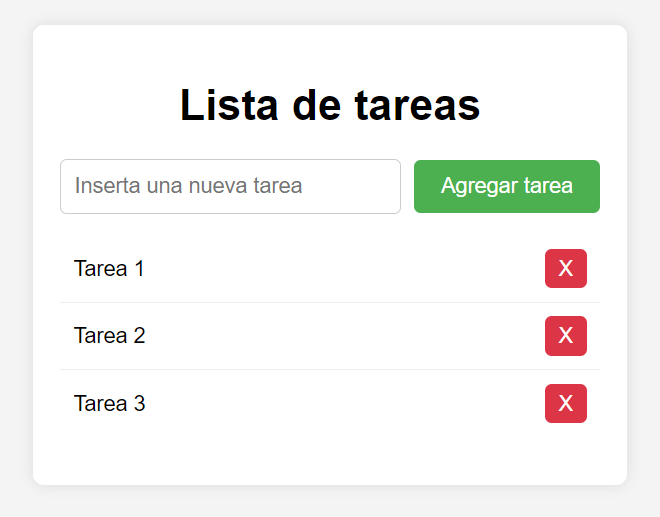

# Ejercicio Agregar tareas a un listado mediante JavaScript
### Implementa la funcionalidad de agregar tareas a una lista cuando se hace clic en el botón «Agregar tarea».


### Instrucciones:
Utiliza el código HTML proporcionado que contiene un input para insertar nuevas tareas y un botón para agregarlas, junto con una lista (ul) donde se mostrarán las tareas.
```html
<div id="taskContainer">
  <h1>Lista de tareas</h1>
  <div class="inputContainer">
    <input type="text" id="newTaskInput" placeholder="Inserta una nueva tarea">
    <button id="addTaskBtn">Agregar tarea</button>
  </div>
  <ul id="taskList">
    <!-- Aquí se agregarán las tareas -->
  </ul>
</div>
```
Utiliza el código CSS proporcionado para dar estilo a los elementos.
```css
body {
  font-family: Arial, sans-serif;
  background-color: #f4f4f4;
  margin: 0;
  padding: 0;
  display: flex;
  justify-content: center;
  align-items: center;
  margin: 20px;
}

#taskContainer {
  width: 400px;
  background-color: #fff;
  border-radius: 8px;
  box-shadow: 0 0 10px rgba(0, 0, 0, 0.1);
  padding: 20px;
}

h1 {
  text-align: center;
}

.inputContainer {
  display: flex;
  align-items: center;
  margin-bottom: 10px;
}

input[type="text"] {
  flex: 1;
  padding: 10px;
  margin-right: 10px;
  border: 1px solid #ccc;
  border-radius: 5px;
  font-size: 16px;
}

button {
  padding: 10px 20px;
  background-color: #4caf50;
  color: #fff;
  border: none;
  border-radius: 5px;
  cursor: pointer;
  font-size: 16px;
  transition: background-color 0.3s;
}

button:hover {
  background-color: #45a049;
}

ul {
  list-style-type: none;
  padding: 0;
}

li {
  padding: 10px;
  border-bottom: 1px solid #eee;
  display: flex;
  justify-content: space-between;
  align-items: center;
}

li:last-child {
  border-bottom: none;
}

.deleteBtn {
  background-color: #dc3545;
  color: #fff;
  border: none;
  border-radius: 5px;
  padding: 5px 10px;
  cursor: pointer;
  transition: background-color 0.3s;
}

.deleteBtn:hover {
  background-color: #d32f2f;
}
```
Completa el código JavaScript para agregar tareas a la lista cuando se hace clic en el botón «Agregar tarea».


